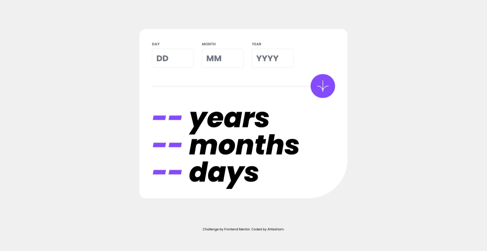

# Frontend Mentor - Age calculator app solution

This is a solution to the [Age calculator app challenge on Frontend Mentor](https://www.frontendmentor.io/challenges/age-calculator-app-dF9DFFpj-Q). Frontend Mentor challenges help you improve your coding skills by building realistic projects. 

## Table of contents

- [Screenshot](#screenshot)
- [Links](#links)
- [Built with](#built-with)
- [Author](#author)

## Screenshot

## Links

- Solution URL: [Github Repo](https://github.com/ahtesham-clcbws/UI-Age-Calculator-app)
- Live Site URL: [Netlify](https://ui-age-calculator.netlify.app)

## Built with

- HTML5 markup
- [React](https://reactjs.org/) - JS library
- [TailwindCss](https://tailwindcss.com/) - CSS framework

## Author

- Website - [Broadway Web Services](https://www.clcbws.com)
- Frontend Mentor - [@ahtesham-clcbws](https://www.frontendmentor.io/profile/ahtesham-clcbws)

